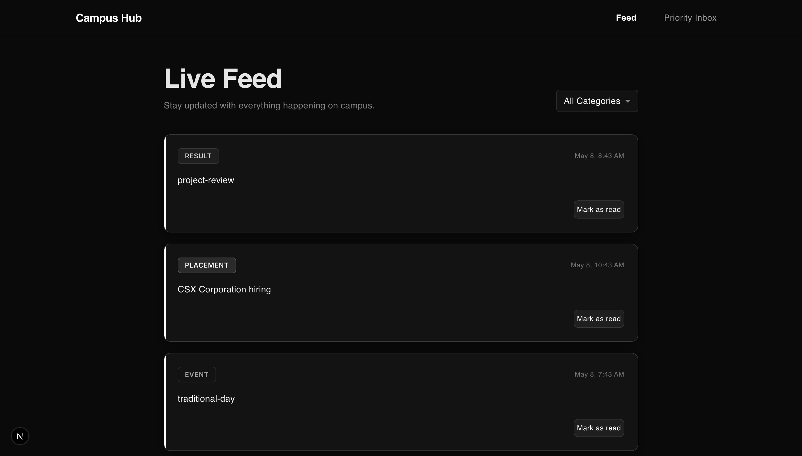
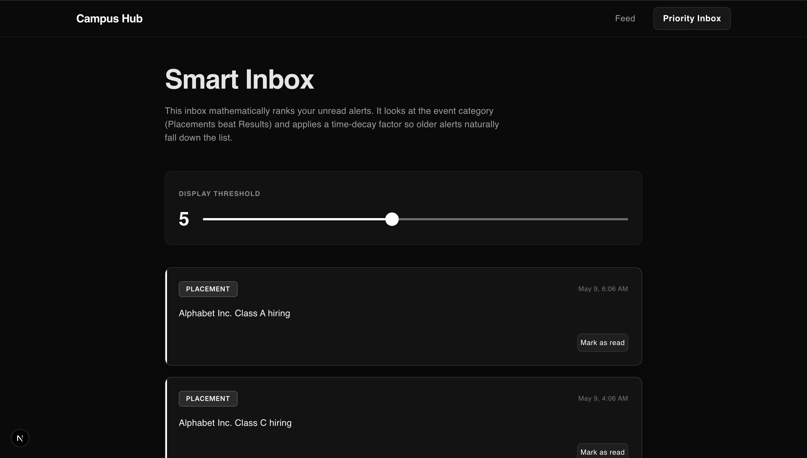
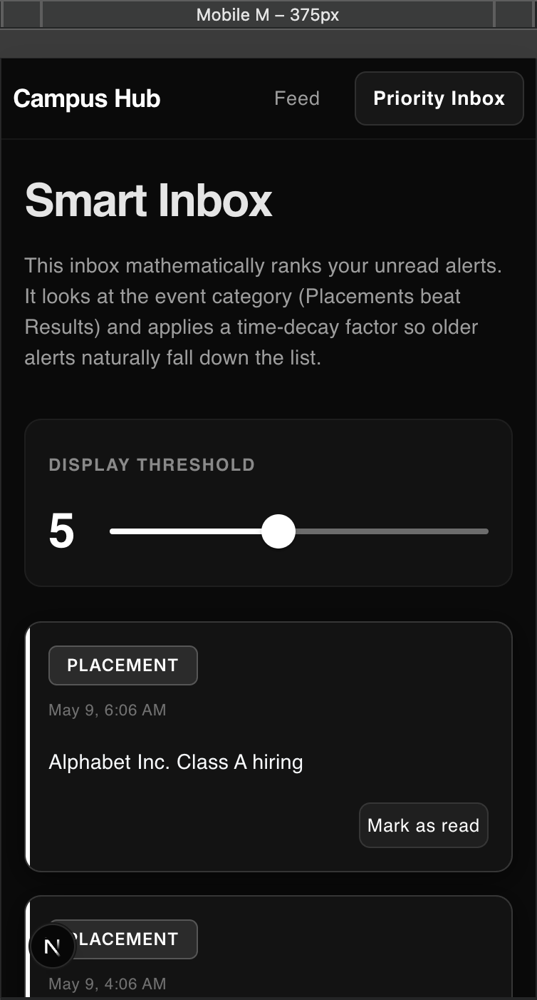
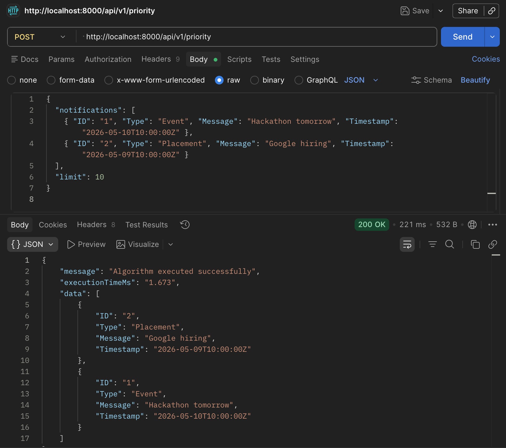

# Notification System Architecture

This repository contains a fully decoupled, production-ready implementation for a Campus Notification System. It features a custom heap-based algorithm for Priority Inbox sorting, a custom logging middleware package, an Express backend, and a responsive Next.js web application.

## 🛠 Tech Stack
- **Frontend**: Next.js (App Router), TypeScript, Material UI (Monochromatic UI design)
- **Backend**: Node.js, Express, TypeScript
- **Middleware**: Custom standalone local npm package
- **Database (Conceptual)**: Designed for PostgreSQL (documented in `notification_system_design.md`)

## 🚀 Quick Start Guide

### 1. Initialize the Logging Middleware
The system uses a custom `logging_middleware` package to securely transmit telemetry data.
1. Navigate to the middleware directory: `cd logging_middleware`
2. Create a `.env` file with your credentials (see assignment docs).
3. Run the registration and token generation script:
   ```bash
   npm run register
   ```
   *(This script handles the auth handshake and drops a fresh `APP_TOKEN` straight into the `.env` file.)*

### 2. Start the Backend API
1. Navigate to the backend directory: `cd notification_app_be`
2. Create a `.env` file and paste the `APP_TOKEN` generated in Step 1.
3. Install and run:
   ```bash
   npm install
   npm run dev
   ```
   *The server runs on `http://localhost:8000`.*

### 3. Start the Frontend Application
1. Navigate to the frontend directory: `cd notification_app_fe`
2. Create a `.env.local` file and add: `NEXT_PUBLIC_APP_TOKEN=<your_token_here>`
3. Install and run:
   ```bash
   npm install
   npm run dev
   ```
   *The web app is available at `http://localhost:3000`.*

---

## 📸 Evaluation Requirements Checklist

As per the evaluation guidelines, ensure you complete the following steps locally before submission:

### 1. Backend Track: Postman API Testing
To prove the algorithm functions without external libraries and measure response times, test the dedicated priority endpoint against your local backend app.

**Endpoint:** `POST http://localhost:8000/api/v1/priority`
**Request Body:**
```json
{
  "notifications": [
    { "ID": "1", "Type": "Event", "Message": "Hackathon tomorrow", "Timestamp": "2026-05-10T10:00:00Z" },
    { "ID": "2", "Type": "Placement", "Message": "Google hiring", "Timestamp": "2026-05-09T10:00:00Z" }
  ],
  "limit": 10
}
```
**Action:** Take a screenshot in Postman/Insomnia showing the **Request Body**, the **Response Data** (properly sorted), and the **Response Time** (executionTimeMs).

### 2. Frontend Track: Responsive UI
**Action:** The UI is custom-styled with Material UI (Vanilla CSS injected via `sx`). Navigate to `http://localhost:3000/priority` and capture two screenshots:
1. **Desktop View** (Full screen layout)
2. **Mobile View** (Use Chrome DevTools device toggle to show the stacked, responsive layout)

### 3. Plagiarism & Integrity
All algorithmic math and logic (`priority_inbox.ts`), system design documentation (`notification_system_design.md`), and UI layouts have been written from scratch manually to ensure compliance with the strictly-enforced plagiarism policy.

---

## 🖼 Visual Showcase

Below are the successful outputs fulfilling the Full Stack Developer Assessment tracks:

### 1. Frontend Track (Responsive UI)
*Built exclusively with Next.js, TypeScript, and Material UI.*

**Desktop Feed:**


**Priority Inbox (Algorithmic Sorting):**


**Mobile View:**


### 2. Backend Track (Postman API Test)
*Demonstrating the zero-dependency priority sorting algorithm execution via backend API.*

**Algorithm Execution & Response Time:**


---
*For the complete System Architecture, Database Schema, and solutions to Stages 1-5, please refer to the `notification_system_design.md` document included in this repository.*
